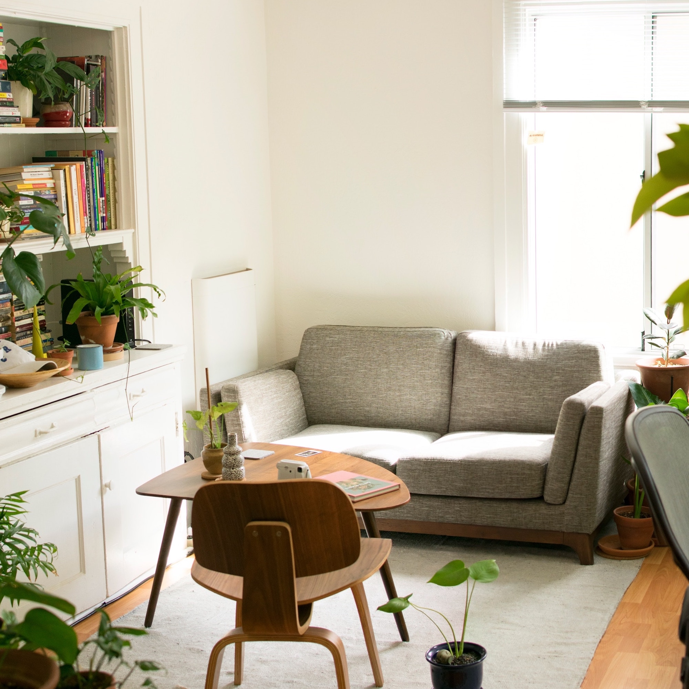

<leadin>
Är du nyfiken på att flytta till Kalmar så har vi sammanställt länkar om boende, jobb till medflyttandepartner, studier och evenemang här.
</leadin>

<grid flexdirection="row">
	<grid-item href="https://kalmarsundsregionen.com/boende/" title="Boende"  nofollow="true" background="#4cc178" aligntext="left" flex="2">
		
	</grid-item>
	<grid-item href="https://kalmarsundsregionen.com/jobb/" title="Jobb åt partner" nofollow="true" background="#c14b7f" aligntext="left" flex="2">
		
	</grid-item>
</grid>

<grid flexdirection="row">
	<grid-item href="https://kalmarsundsregionen.com/studier/" title="Studier"  nofollow="true" background="#c17e4b" aligntext="left" flex="2">
		
	</grid-item>
	<grid-item href="https://kalmarsundsregionen.com/evenemang/" title="Evenemang"  nofollow="true" background="#4baac1" aligntext="left" flex="2">
		
	</grid-item>
</grid>
